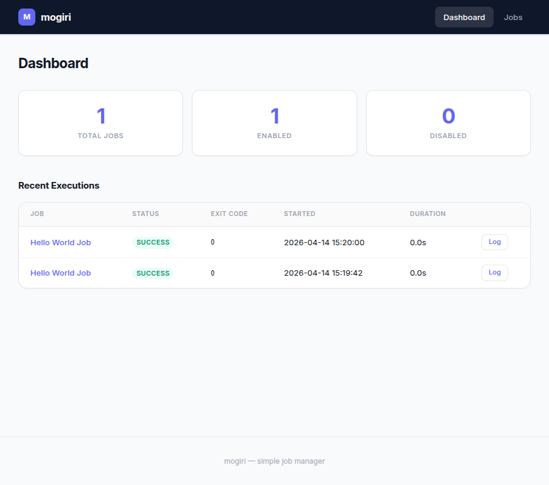
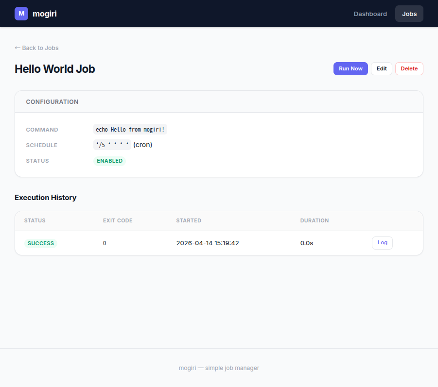
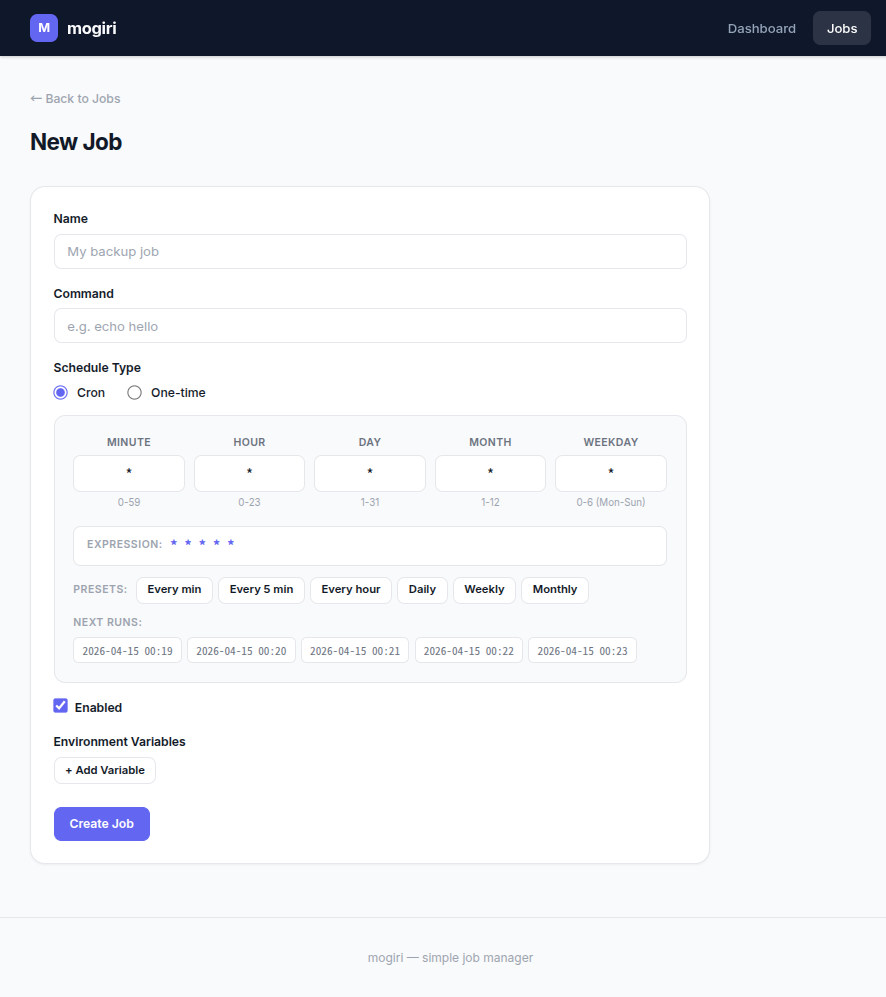
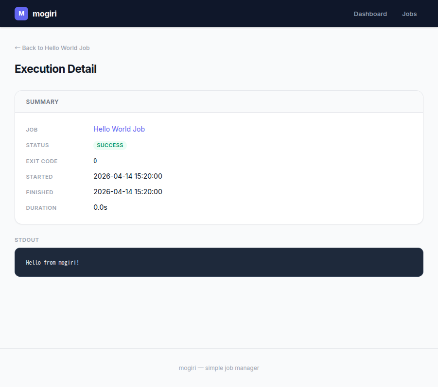

<p align="center">
  
</p>

<h1 align="center">mogiri</h1>

<p align="center">
  <em>Simple local job manager with Web UI</em>
</p>

<p align="center">
  
  
  
</p>

---

ローカルで動作するシンプルなジョブ管理ツール。Web UI からジョブの作成・スケジュール実行・ログ閲覧ができます。

## Screenshots

<table>
  <tr>
    <td align="center"><strong>Dashboard</strong></td>
    <td align="center"><strong>Job Detail</strong></td>
  </tr>
  <tr>
    <td></td>
    <td></td>
  </tr>
  <tr>
    <td align="center"><strong>Job Form (with cron editor)</strong></td>
    <td align="center"><strong>Execution Log</strong></td>
  </tr>
  <tr>
    <td></td>
    <td></td>
  </tr>
</table>

## Features

| Feature | Description |
|---------|-------------|
| **Cron / One-time / Manual** | cron 式による定期実行、日時指定の一回実行、手動実行 |
| **Shell & Python** | シェルコマンドまたは Python スクリプトを実行 |
| **Workflows** | 複数ジョブを DAG で連結し、成功/失敗条件で分岐実行 |
| **AI Assistant** | ジョブ作成画面で Claude / Gemini CLI によるスクリプト生成支援 |
| **Environment Variables** | グローバル + ジョブ別の環境変数。チェーン実行時は親ジョブの結果を自動注入 |
| **Execution Logs** | stdout / stderr を保存し、Web UI から閲覧。自動ローテーション対応 |
| **REST API** | ジョブ・ワークフロー・実行履歴・設定の JSON API |
| **CLI Client** | `mogiricli` コマンドでターミナル / Claude Code からジョブ管理 |
| **Sample Scripts** | Slack 通知、DB バックアップ、ヘルスチェック等のサンプル集 |

## Quick Start

```bash
# インストール
pip install -e .

# 設定ファイルの生成（オプション）
mogiri init

# サーバー起動
mogiri serve
```

ブラウザで **http://127.0.0.1:8899** にアクセスしてください。

```bash
# オプション
mogiri serve --host 0.0.0.0 --port 9000 --debug
mogiri serve --config /path/to/config.yaml
```

---

## CLI Client (`mogiricli`)

mogiri サーバーの REST API をラップした CLI ツールです。ターミナルや Claude Code からジョブ・ワークフローを操作できます。

```bash
# サーバー URL の設定（デフォルト: http://127.0.0.1:8899）
export MOGIRI_URL=http://127.0.0.1:8899
```

### Jobs

```bash
mogiricli jobs list                          # 一覧
mogiricli jobs get <id>                      # 詳細
mogiricli jobs create --name "Backup" \
  --command "pg_dump mydb" \
  --command-type shell                       # 作成
mogiricli jobs update <id> --name "New Name" # 更新
mogiricli jobs delete <id> --yes             # 削除
mogiricli jobs run <id>                      # 即時実行
```

### Workflows

```bash
mogiricli workflows list                     # 一覧
mogiricli workflows create --name "My Flow"  # 作成
mogiricli workflows run <id>                 # 実行
mogiricli workflows delete <id> --yes        # 削除
```

### Executions

```bash
mogiricli executions list --limit 10         # 直近の実行一覧
mogiricli executions list --job-id <id>      # ジョブでフィルタ
mogiricli executions get <execution-id>      # 詳細 (stdout/stderr)
```

### Settings

```bash
mogiricli settings get ai_provider           # 取得
mogiricli settings set ai_provider gemini    # 更新
```

### JSON Output

`--json` フラグで JSON 出力に切り替え。スクリプトや Claude Code との連携に便利です。

```bash
mogiricli --json jobs list
mogiricli --json executions get <id>
```

---

## REST API

`mogiricli` が内部で使用している JSON API です。直接 curl 等でも利用できます。

<details>
<summary>API エンドポイント一覧</summary>

| Method | Path | Description |
|--------|------|-------------|
| `GET` | `/api/jobs` | ジョブ一覧 |
| `GET` | `/api/jobs/<id>` | ジョブ詳細 |
| `POST` | `/api/jobs` | ジョブ作成 |
| `PATCH` | `/api/jobs/<id>` | ジョブ更新 |
| `DELETE` | `/api/jobs/<id>` | ジョブ削除 |
| `POST` | `/api/jobs/<id>/run` | ジョブ即時実行 |
| `GET` | `/api/workflows` | ワークフロー一覧 |
| `GET` | `/api/workflows/<id>` | ワークフロー詳細 |
| `POST` | `/api/workflows` | ワークフロー作成 |
| `PATCH` | `/api/workflows/<id>` | ワークフロー更新 |
| `DELETE` | `/api/workflows/<id>` | ワークフロー削除 |
| `POST` | `/api/workflows/<id>/run` | ワークフロー実行 |
| `GET` | `/api/executions` | 実行履歴 (`?job_id=`, `?workflow_id=`, `?limit=`) |
| `GET` | `/api/executions/<id>` | 実行詳細 (stdout/stderr) |
| `GET` | `/api/settings/<key>` | 設定取得 |
| `PUT` | `/api/settings/<key>` | 設定更新 |

</details>

<details>
<summary>curl の使用例</summary>

```bash
# ジョブ作成
curl -s -X POST http://127.0.0.1:8899/api/jobs \
  -H 'Content-Type: application/json' \
  -d '{"name": "Hello", "command": "echo hello", "schedule_type": "none"}'

# ジョブ実行
curl -s -X POST http://127.0.0.1:8899/api/jobs/<id>/run

# 実行結果の確認
curl -s http://127.0.0.1:8899/api/executions?job_id=<id>&limit=1
```

</details>

---

## Sample Scripts

`samples/` ディレクトリにジョブ作成に使えるサンプルスクリプトを用意しています。AI Chat でもサンプルを参照してスクリプト生成します。

| Script | Description |
|--------|-------------|
| [`slack_thread_post.py`](samples/slack_thread_post.py) | Slack スレッド投稿 |
| [`pushover_notify.py`](samples/pushover_notify.py) | Pushover プッシュ通知 |
| [`db_backup.py`](samples/db_backup.py) | PostgreSQL / MySQL バックアップ |
| [`http_health_check.py`](samples/http_health_check.py) | HTTP ヘルスチェック |
| [`disk_usage_alert.sh`](samples/disk_usage_alert.sh) | ディスク使用量監視 |
| [`ai_summarize.sh`](samples/ai_summarize.sh) | Claude CLI で前段ジョブの出力を要約 |
| [`ai_log_analyzer.py`](samples/ai_log_analyzer.py) | Claude CLI でログファイルを分析 |
| [`claude_usage_check.py`](samples/claude_usage_check.py) | Claude Code の使用量/レート制限チェック |

詳細は [samples/README.md](samples/README.md) を参照してください。

---

## Job Environment Variables

ジョブ実行時に mogiri が自動的にセットする環境変数です。

### 全ジョブ共通

| 変数 | 説明 |
|---|---|
| `MOGIRI_OUTPUT` | 出力ファイルのパス。ここに書き込んだ内容が、Workflow の次のジョブに `MOGIRI_PARENT_OUTPUT` として渡される |

### Workflow チェーンジョブ（親ジョブから実行された場合のみ）

| 変数 | 説明 |
|---|---|
| `MOGIRI_PARENT_OUTPUT` | 親ジョブが `MOGIRI_OUTPUT` に書き込んだ内容 |
| `MOGIRI_PARENT_JOB_NAME` | 親ジョブの名前 |
| `MOGIRI_PARENT_STATUS` | 親ジョブの終了ステータス (`success` / `failed` / `timeout`) |
| `MOGIRI_PARENT_EXIT_CODE` | 親ジョブの終了コード |
| `MOGIRI_PARENT_STDOUT` | 親ジョブの stdout（末尾 4000 文字） |
| `MOGIRI_PARENT_STDERR` | 親ジョブの stderr（末尾 4000 文字） |
| `MOGIRI_PARENT_EXECUTION_ID` | 親ジョブの Execution ID |

### Workflow でのデータ受け渡し例

```bash
# ジョブ A（親）
echo "backup completed: /tmp/backup_20240418.sql" >> $MOGIRI_OUTPUT

# ジョブ B（子） — 親の出力を利用
echo "Parent output: $MOGIRI_PARENT_OUTPUT"
```

```python
# ジョブ A（親・Python）
import os
with open(os.environ["MOGIRI_OUTPUT"], "a") as f:
    f.write("processed 1234 records\n")

# ジョブ B（子・Python）
import os
parent_output = os.environ.get("MOGIRI_PARENT_OUTPUT", "")
print(f"Parent said: {parent_output}")
```

---

## Configuration

`mogiri init` で `~/.mogiri/config.yaml` にサンプルが生成されます。

```yaml
server:
  host: "127.0.0.1"
  port: 8899

log:
  retention_days: 30    # 0 = keep forever
  max_per_job: 100      # 0 = unlimited
```

| 環境変数 | 説明 |
|---|---|
| `MOGIRI_DATA_DIR` | データディレクトリ (default: `~/.mogiri`) |
| `MOGIRI_LOG_RETENTION_DAYS` | ログ保持日数 |
| `MOGIRI_LOG_MAX_PER_JOB` | ジョブごとの最大保持件数 |

設定の優先順位: デフォルト値 < YAML < 環境変数 < CLI フラグ

### cron 式の例

| 式 | 意味 |
|---|---|
| `* * * * *` | 毎分 |
| `*/5 * * * *` | 5分ごと |
| `0 * * * *` | 毎時0分 |
| `0 0 * * *` | 毎日0時 |
| `0 0 * * 0` | 毎週日曜0時 |
| `0 0 1 * *` | 毎月1日0時 |

---

## Autostart (systemd)

Linux (Ubuntu等) で OS 起動時に mogiri を自動起動するには、systemd のユーザーサービスを使います。

### 1. サンプルをコピー

```bash
mkdir -p ~/.config/systemd/user
cp docs/mogiri.service ~/.config/systemd/user/mogiri.service
```

### 2. ExecStart のパスを確認・修正

unit ファイルの `ExecStart` に `mogiri` コマンドのフルパスを設定してください。

```bash
# pyenv の場合
pyenv which mogiri
# 例: /home/youruser/.pyenv/versions/mogiri/bin/mogiri

# pip でインストールした場合
which mogiri
```

出力されたパスが `ExecStart` と異なる場合は修正してください。

### 3. 有効化・起動

```bash
# systemd にファイルを認識させる
systemctl --user daemon-reload

# 起動
systemctl --user start mogiri

# 状態確認
systemctl --user status mogiri

# OS 起動時の自動起動を有効化
systemctl --user enable mogiri
```

### 4. ログイン不要での自動起動

デフォルトではユーザーがログインしている間のみサービスが動作します。
SSH やデスクトップにログインしていなくても起動させるには **linger** を有効にしてください。

```bash
sudo loginctl enable-linger $(whoami)
```

### ログ確認

```bash
# リアルタイムでログを表示
journalctl --user -u mogiri -f

# 最近のログを表示
journalctl --user -u mogiri --since "1 hour ago"
```

### 停止・無効化

```bash
systemctl --user stop mogiri      # 停止
systemctl --user disable mogiri   # 自動起動を無効化
```

---

## Development

```bash
# 開発用依存もインストール
pip install -e ".[dev]"

# テスト実行
pytest tests/ -v

# Lint
ruff check src/ tests/
```

### DB マイグレーション

```bash
# モデル変更後にマイグレーションファイルを生成
FLASK_APP=mogiri.app flask db migrate -m "add new column"

# マイグレーションを適用
FLASK_APP=mogiri.app flask db upgrade
```

`mogiri serve` 起動時に未適用のマイグレーションは自動で適用されます。

---

## Data

すべてのデータは `~/.mogiri/` に保存されます:

- `mogiri.db` -- SQLite データベース (ジョブ定義・実行履歴)
- `config.yaml` -- 設定ファイル

## License

MIT
